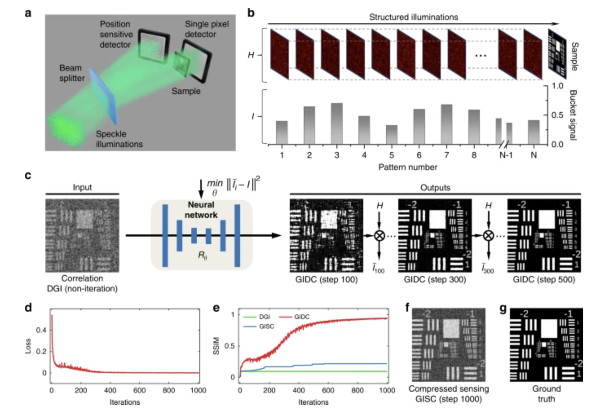

# GIDC
Tensorflow implementation of paper: [Far-field super-resolution ghost imaging with a deep neural network constraint](https://www.nature.com/articles/s41377-021-00680-w). One of the experiment data was provided.

## Citation
If you find this project useful, we would be grateful if you cite the **GIDC paper**：

Fei Wang, Chenglong Wang, Mingliang Chen, Wenlin Gong, Yu Zhang, Shensheng Han and Guohai Situ. Far-field super-resolution ghost imaging with a deep neural network constraint. Light Sci Appl 11, 1 (2022).

## Abstract
Ghost imaging (GI) facilitates image acquisition under low-light conditions by single-pixel measurements and thus has great potential in applications in various fields ranging from biomedical imaging to remote sensing. However, GI usually requires a large amount of single-pixel samplings in order to reconstruct a high-resolution image, imposing a practical limit for its applications. Here we propose a far-field super-resolution GI technique that incorporates the physical model for GI image formation into a deep neural network. The resulting hybrid neural network does not need to pre-train on any dataset, and allows the reconstruction of a far-field image with the resolution beyond the diffraction limit. Furthermore, the physical model imposes a constraint to the network output, making it effectively interpretable. We experimentally demonstrate the proposed GI technique by imaging a flying drone, and show that it outperforms some other widespread GI techniques in terms of both spatial resolution and sampling ratio. We believe that this study provides a new framework for GI, and paves a way for its practical applications.

## Overview

## How to use
**Step 1: Configuring required packages**

python 3.9
tensorflow 2.10.0
matplotlib 3.9.4
numpy 1.23.5
pillow 11.3.0
scipy 1.13.1
h5py  3.14.0
contourpy 1.3.0
cycler 0.12.1 
fonttools 4.60.2 
kiwisolver 1.4.7 
pyparsing 3.2.5 
python-dateutil 2.9.0.post0 
importlib-resources 6.5.2

**Step 2: Run GIDC_main.py after download and extract the ZIP file.**
